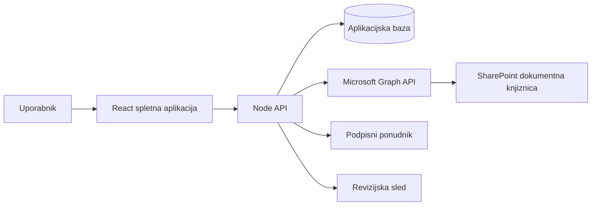

# Arhitektura

Aplikacija je locena na spletni vmesnik, API in SharePoint dokumentni repozitorij.

## Odgovornosti

- SharePoint hrani datoteke in uradne verzije.
- Aplikacijska baza hrani metapodatke, statuse, workflow, revizijsko sled in podpisne dogodke.
- API izvaja poslovna pravila in dostop do Graph API.
- Frontend nudi namenski eDMS vmesnik za uporabnike.
